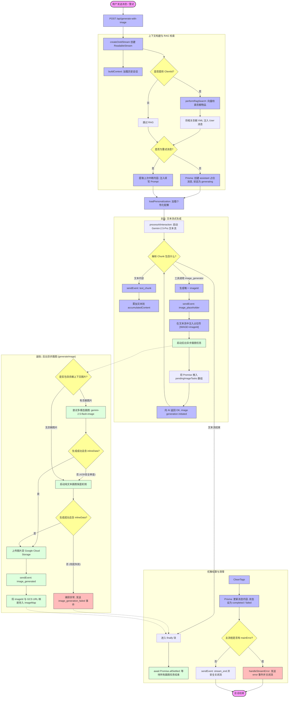
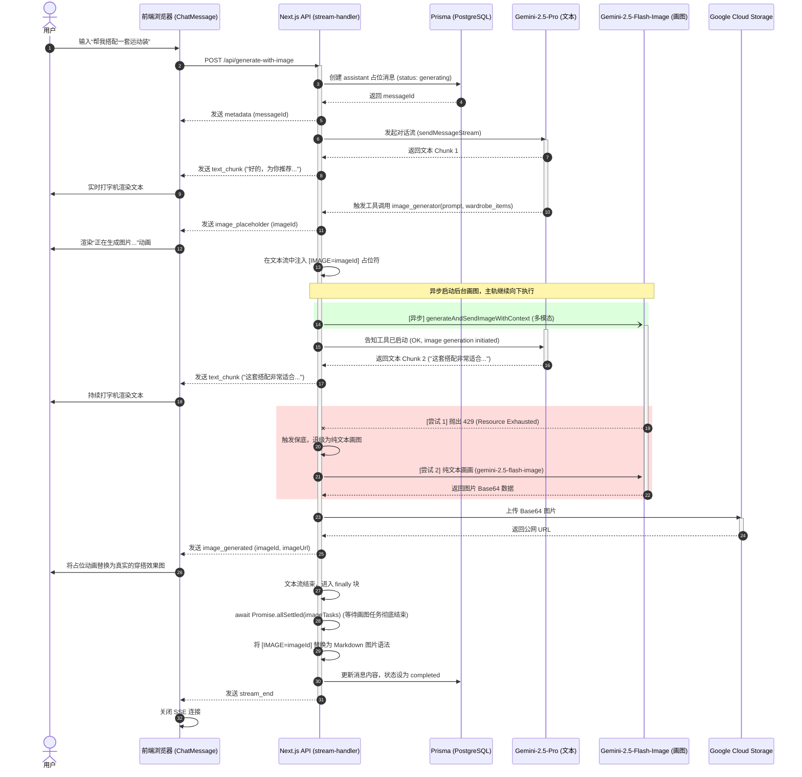

# OOTD-Agent AI 核心工作流设计文档 (AI Workflow Design)

本篇文档详细记录了 OOTD-Agent 的 AI 核心工作流。该工作流采用了**主文本流与后台异步画图任务分离、RAG 增强检索、多模态画图保底退级、以及流式响应优雅结算**的现代化架构设计，确保了极佳的用户体验与系统稳定性。

---

## 1. 核心架构概述

OOTD-Agent 的 AI 交互采用 **Server-Sent Events (SSE)** 流式输出。为了解决“画图耗时久导致用户干等”的问题，系统采用了**双轨并行架构**：
1. **主轨 (Main Track)**：负责 Gemini-2.5-Pro 文本流式生成。AI 边想边吐字，前台打字机实时渲染。
2. **副轨 (Background Track)**：当 AI 决定画图时，主轨立即向前端发送图片占位符，并将画图任务以 `Promise` 形式推入后台异步执行。主轨继续生成文本，不作任何等待。
3. **优雅结算 (Graceful Settlement)**：在文本流彻底结束后的 `finally` 块中，系统会挂起并等待所有后台画图任务完成，清洗未成功生成的占位符，更新数据库，最后安全关闭连接。

---

## 2. AI 工作流流程图 (Flowchart)

以下是 OOTD-Agent 完整的端到端工作流图：



---

## 3. 时序交互图 (Sequence Diagram)

以下时序图展示了前端、Next.js API 路由、Gemini 文本模型、Gemini 图像模型以及 GCS 之间的动态交互与时间重叠关系：



---

## 4. 关键容错与安全机制说明

### 4.1 绕过 XSS 过滤的行内渲染机制
* **问题**：`react-markdown` 默认会过滤掉非标准协议（如 `wardrobe:id`），导致 `href` 变为空字符串，且将文本切碎渲染会导致 `<ul>` / `<li>` 块级标签强制换行。
* **解决**：
  1. 预处理文本，将 `[衣橱物品:id=xxx]` 替换为标准的相对路径 `[衣橱物品](/wardrobe-item/xxx)`。
  2. 相对路径符合标准 URL 规范，完美绕过 XSS 过滤器。
  3. 在 `ReactMarkdown` 的 `components.a` 中拦截 `/wardrobe-item/` 前缀，将其渲染为 `inline-flex` 的 `WardrobeItem` 组件，实现完美的行内无缝排版。

### 4.2 双重画图保底机制 (Fallback)
* **问题**：多模态画图（传入衣橱实物图作为上下文）可能因为图片格式、安全政策审查或 429 频控而失败。
* **解决**：
  1. 在 `generateImage.ts` 中，多模态调用被包裹在 `try-catch` 中。
  2. 一旦多模态调用抛出异常，或者返回的数据中不含 `inlineData`，系统会自动触发**纯文本画图保底机制**（仅使用 Prompt 词，不传上下文图片）。
  3. 纯文本画图同样享受 `async-retry` 的 2 次退避重试保护。

### 4.3 占位符安全清洗 (Sanitization)
* **问题**：如果画图任务在经历所有重试后依然彻底失败，文本中残留的 `[IMAGE=img-xxx]` 占位符会直接裸露给用户，影响观感。
* **解决**：
  1. 在 `stream-handler.ts` 的 `finally` 块中，系统会使用正则安全清洗所有未成功替换的占位符：
     ```typescript
     finalContent = finalContent.replace(/\[IMAGE=[^\]]+\]/g, '\n\n*(❌ 效果图生成失败)*\n\n');
     ```
  2. 确保最终写入数据库和展示给用户的文本永远是干净、友好的。