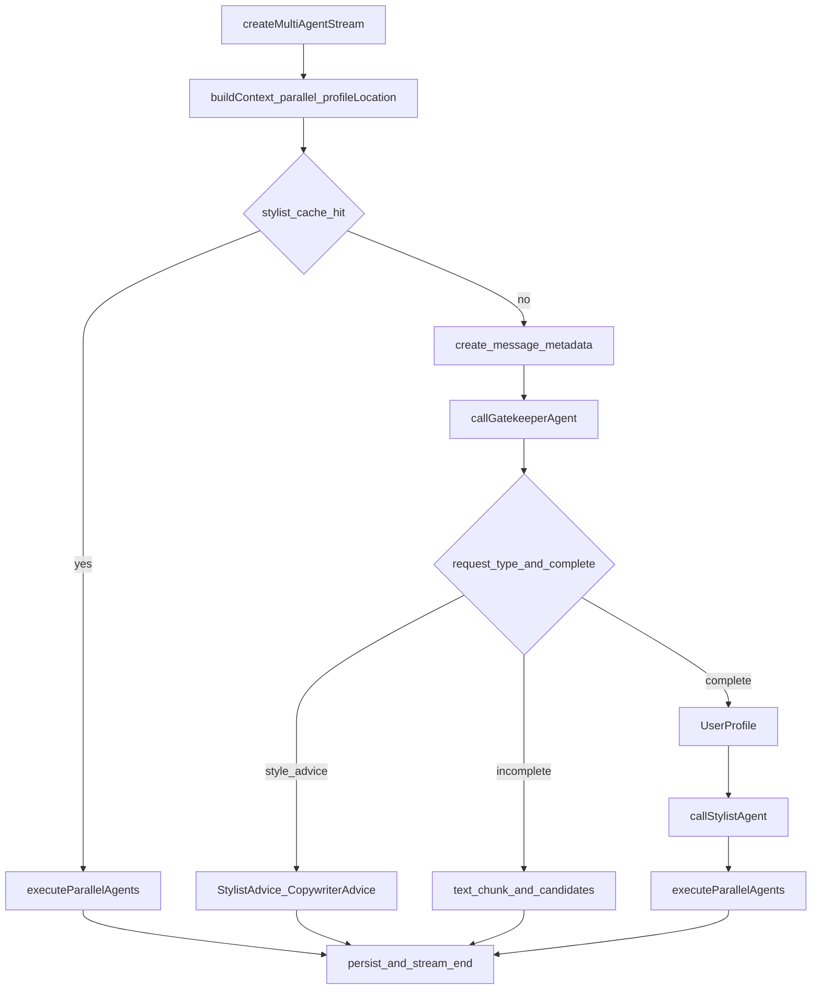

# LangGraph 编排层迁移（仅 orchestrator）

> 状态：已实施第一期（编排层 Graph），待对话验收。  
> 日期：2026-07-08  
> 范围：只用 Vertex Gemini（现有 `@google/genai`）；只把 `orchestrator` 改成 LangGraph.js。

## 1. 背景与动机

当前多 Agent 主链路在 [`app/api/generate-with-image/orchestrator.ts`](../app/api/generate-with-image/orchestrator.ts) 里用手写 `if/else` 编排：

```
buildContext → Gatekeeper → (clarify | style_advice | outfit)
  → UserProfile → Stylist → Copywriter ∥ Visual
```

目标是用 **LangGraph.js** 显式表达阶段与分支，便于学习和后续扩展（例如以后再加 Tool 节点、或再迁 ChatModel），但 **本期不碰模型调用层**。

鉴权说明：项目通过 Vertex（`PROJECT_ID` + `LOCATION` + ADC）调用 Gemini，不是 AI Studio API Key。LangChain 的 `ChatVertexAI` 也支持同一套鉴权，但 **本期不引入**，各 Agent 继续直调 `genAI`。

## 2. 目标与边界

### 做

- 用 LangGraph.js 表达现有 orchestrator 的分流与阶段顺序
- [`route.ts`](../app/api/generate-with-image/route.ts) 仍调用 `createMultiAgentStream`
- 对外 SSE 事件契约不变（`progress` / `text_chunk` / `metadata` / `image_*` / `stream_end` / `error` / `wardrobe_candidates`）

### 不做

- 不把 Gatekeeper / Stylist / Copywriter / UserProfile 改成 LangChain `ChatModel`
- 不换模型供应商、不改 [`server/services/ai.ts`](../server/services/ai.ts) Vertex 鉴权
- 不动 embedding / 出图 / RAG 实现细节
- 不改 `createImageRetryStream`（仍走 [`imageRetry.ts`](../app/api/generate-with-image/imageRetry.ts)）
- 本期不引入 `@langchain/google-vertexai`

## 3. 现状控制流（须照抄进 Graph）



副作用（progress、text_chunk、落库）继续由编排边界发出；Graph 节点内部只调用现有 agent 函数。

## 4. 设计决策

1. **依赖：** `@langchain/langgraph` + `@langchain/core`
2. **非序列化上下文：** `controller`、`ragCache`、`imageMap`、`failedImageIds` 放入 `configurable.runtime`（或闭包），**不进入** Graph state，避免 checkpoint / 序列化问题
3. **State 只存决策结果：** history、gatekeeperResult、intent、profile、stylistResult、分支标记、文案累积相关字段、错误信息等
4. **流入口不动：** `createMultiAgentStream` 仍返回 `ReadableStream`；`start` 内 `await graph.invoke(initialState, { configurable })`；外层 `try/finally` 保留现有落库与 `stream_end` / `handleStreamError`

## 5. 文件结构

| 文件 | 职责 |
|------|------|
| `app/api/generate-with-image/graph/state.ts` | `Annotation` 定义 pipeline state |
| `app/api/generate-with-image/graph/nodes.ts` | gatekeeper / 分支处理 / profile / stylist / parallelAgents / advice |
| `app/api/generate-with-image/graph/outfitPipeline.ts` | `StateGraph` 组边 + `compile()` |
| `app/api/generate-with-image/orchestrator.ts` | 瘦身：runtime context + invoke + finally |
| `package.json` | 增加 langgraph 依赖 |

### 节点表（与现逻辑对齐）

| 节点 | 行为 |
|------|------|
| `resolveCache` | 读 failedMessage 的 stylist_cache；命中则走缓存并行路径 |
| `ensureMessage` | 创建 placeholder message + `metadata` SSE |
| `gatekeeper` | progress + `callGatekeeperAgent` |
| `styleAdvicePath` | `callStylistAdvice` + `callCopywriterAdviceStream` |
| `followupPath` | 追问文案 + 可选 `wardrobe_candidates` |
| `loadProfile` | UserProfile（可跳过） |
| `stylist` | `callStylistAgent` + 缓存落库 |
| `parallelOutfits` | Copywriter 流式 ∥ Visual 出图（现 `executeParallelAgents`） |

条件边路由键：`from_cache` | `style_advice` | `incomplete` | `outfit_main`。

## 6. 实施步骤

1. 本文档确认（已完成）
2. `pnpm add @langchain/langgraph @langchain/core`
3. 实现 `graph/state.ts`、`nodes.ts`、`outfitPipeline.ts`；从 orchestrator 平移分支逻辑；日志可加 `[ORCHESTRATOR:LANGGRAPH]` 便于对比
4. 瘦身 `orchestrator.ts` 为 invoke 入口；`route.ts` 尽量不改
5. 本地验收（见第 7 节）+ `pnpm exec tsc --noEmit`

## 7. 验收标准

### 对话场景

- [ ] 普通 `wardrobe_outfit`：progress 顺序仍为 gatekeeper → stylist → copywriter，文案 + 效果图正常
- [ ] Gatekeeper `is_complete=false`：只返回追问 / wardrobe_candidates，不出搭配
- [ ] `style_advice`：走建议链路，不触发选品出图
- [ ] 存在 stylist_cache 的断点续传：跳过 Gatekeeper/Stylist，直接并行文案 + 出图

### 工程

- [ ] `pnpm exec tsc --noEmit` 0 errors
- [ ] Agent 文件仍只依赖 `@google/genai` / 现有 `genAI`，无 Vertex LangChain chat 封装
- [ ] SSE 事件类型与前端现有 handler 兼容

### 日志

- [ ] 一次成功搭配对话中仍可见 `[GATEKEEPER]` / `[STYLIST_AGENT]` / `[ORCHESTRATOR]`（或带 LANGGRAPH 后缀）完整阶段

## 8. 风险与缓解

| 风险 | 缓解 |
|------|------|
| 把 `controller` 放进 state 导致不可序列化 | 仅用 `configurable.runtime`；state 保持数据友好 |
| 行为回归 | 第一期不改分支条件，只换壳体；对比同一话术的终端阶段日志 |
| 依赖版本与 Next 16 不兼容 | 使用当前稳定版 langgraph.js，安装后先 `tsc` |

## 9. 后续（不在本期）

- 文本 Agent 改为 LangChain `ChatModel`（可接 `ChatVertexAI`，仍用 Vertex ADC）
- RAG / Tool 节点进入 Graph
- 国内 OpenAI 兼容模型切换
