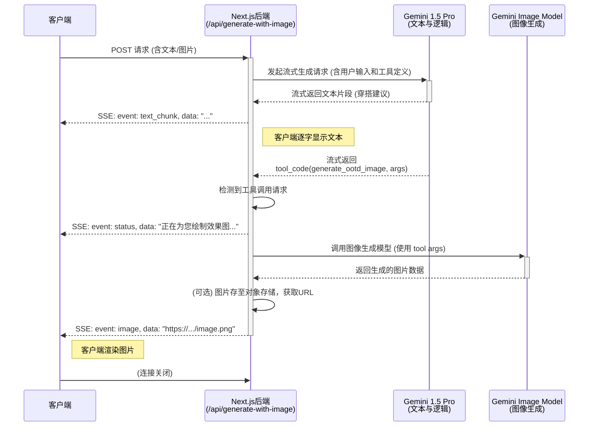

# 设计文档: OOTD 智能对话与图像生成

本文档详细描述了 OOTD-Agent 的核心功能——“智能穿搭建议”的设计与技术实现方案。

## 1. 功能规格 (Functional Specification)

### 1.1. 核心目标
为用户提供一个智能、直观且可视化的每日穿搭（OOTD）建议体验。用户不仅能得到文字指导，还能看到最终穿搭效果图，从而解决“不知道穿什么”和“不确定搭起来好不好看”的核心痛点。

### 1.2. 主要功能特性
1.  **多模态混合输入**: 支持纯文本、纯图片、文本+图片组合的输入方式。
2.  **流式对话响应**: AI 的文字回复以流式（Streaming）方式逐字显示，提供流畅的对话感。
3.  **穿搭可视化**: 在文字建议后，AI **必须**调用图像生成功能，将建议的穿搭可视化为一张效果图。
4.  **智能状态反馈**: 在等待、加载、生成图片、出错等环节，给予用户清晰、友好的状态提示。

### 1.3. 理想交互流程
用户输入需求 -> AI 流式输出文字建议 -> AI 提示正在生成图片 -> AI 输出最终的穿搭效果图。

---

## 2. 技术设计与实现 (Technical Design)

### 2.1. 整体架构与流程
我们将通过一个 API 路由 (`/api/generate-with-image`) 来处理所有逻辑。该路由会接收用户输入，与 Google Gemini 模型交互，并通过 Server-Sent Events (SSE) 将结果流式返回给客户端。

**核心流程图:**


### 2.2. 技术细节分解

#### **Feature 1: 多模态混合输入**
- **API Endpoint**: `POST /api/generate-with-image/route.ts`
- **Request Body**:
  ```json
  {
    "content": {
      "text": "...", // 可选
      "imageUrl": "..." // 可选
    },
    "conversationId": "...",
    "messageId": "..."
  }
  ```
- **后端处理**:
    1.  `route.ts` 接收请求。
    2.  **输入验证**: 确认 `text` 或 `imageUrl` 至少存在一个，否则返回 400 错误。
    3.  **图片处理**: 如果 `imageUrl` 存在，调用工具函数 `urlToGenerativePart`。该函数会:
        -   Fetch 图片 URL。
        -   将图片二进制数据转为 Base64 字符串。
        -   获取图片 MIME 类型。
        -   组装成 Gemini 需要的 `Part` 对象: `{ inlineData: { data: '...', mimeType: '...' } }`。
    4.  **输入组装**: 将图片 `Part` 和文本 `Part` 组合成一个 `Part[]` 数组，图片在前，文本在后。

#### **Feature 2: 流式对话响应**
- **技术栈**: `ReadableStream`, `TextEncoder`, Server-Sent Events (SSE)。
- **后端实现 (`createOotdStream`)**:
    1.  调用 Google Gemini API 的 `generateContentStream` 方法。
    2.  `for await...of` 循环处理返回的数据流。
    3.  在循环中，将收到的每一个数据块 (`chunk`) 进行处理。
    4.  使用 `TextEncoder` 将字符串（如文本内容、状态信息）编码为 `Uint8Array`。
    5.  通过 `controller.enqueue()` 推入 `ReadableStream`。
- **SSE 事件格式**: 为了让客户端能区分不同类型的数据，我们定义不同的 SSE 事件。
  ```
  // 文本片段
  event: text_chunk
  data: {"text": "一件经典的条纹衫"}

  // 状态更新
  event: status
  data: {"message": "正在为您绘制效果图..."}

  // 最终图片
  event: image
  data: {"url": "https://path/to/generated/image.png"}

  // 错误信息
  event: error
  data: {"message": "生成图片时出错"}
  ```

#### **Feature 3: 穿搭可视化 (核心)**
- **技术**: Gemini 的**工具调用 (Tool Calling)** 功能。
- **实现方案**:
    1.  **定义工具**: 在向 `gemini-pro` 发送请求时，除了用户输入，我们还会附带一个工具的定义，名为 `generate_ootd_image`。
        -   **工具描述**: "根据文字描述生成一张穿搭效果图"。
        -   **工具参数**: `description` (string)，描述这套穿搭的详细细节，如“一个穿着白色泡泡袖上衣和高腰直筒牛仔裤的女士”。
    2.  **修改 Prompt**: 我们的系统级 Prompt 会引导 Gemini：**"首先，请给出详细的文字穿搭建议。然后，总结这套穿搭的关键元素，并调用 `generate_ootd_image` 工具来生成效果图。"**
    3.  **后端 `createOotdStream` 逻辑**:
        -   当从 Gemini 流中接收到 `tool_code` 类型的 `chunk` 时，暂停向客户端发送 `text_chunk`。
        -   解析出工具名称 (`generate_ootd_image`) 和参数 (`description`)。
        -   向客户端发送 `event: status`，告知用户开始生成图片。
        -   使用 `description` 作为 Prompt，调用另一个模型（如 `gemini-1.5-flash` 或专门的图像生成模型）来生成图片。
        -   图片生成后，获取其 URL (或 Base64 数据)。
        -   向客户端发送 `event: image`，并附上图片 URL。
    4.  **客户端处理**: 监听到 `image` 事件后，在聊天界面中渲染这张图片。

#### **Feature 4: 智能状态反馈**
- **加载状态**:
    - **前端**: 发送请求后，立即禁用输入框并显示加载指示。
    - **后端**: 通过上文定义的 `event: status` SSE 事件，可以推送更具体的状态，如“正在构思...”、“正在绘画...”。
- **输入验证**:
    - **前端**: 可以在点击发送前做一次快速检查，如果输入框和图片都为空，则按钮置灰或弹出提示。
    - **后端**: `route.ts` 必须做最终验证，如 `1.2` 所述。
- **错误处理**:
    - **后端**: `route.ts` 和 `createOotdStream` 中的所有关键步骤都包裹在 `try...catch` 中。一旦捕获到错误：
        -   在服务器端 `console.error` 记录完整错误。
        -   如果是流已经开始，则通过 `event: error` 推送错误信息到客户端。
        -   如果流还未开始，则直接返回 `500 Internal Server Error` 的 HTTP 响应，body 为 `{ "error": "...", "message": "..." }`。
    - **前端**: 监听 `error` 事件或检查 HTTP 响应状态码，向用户显示友好的错误提示。