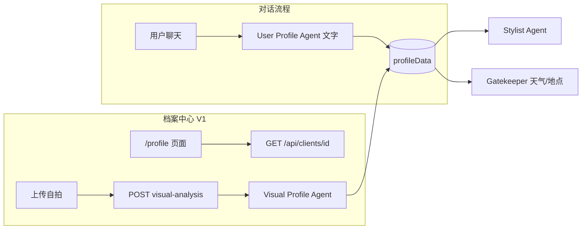
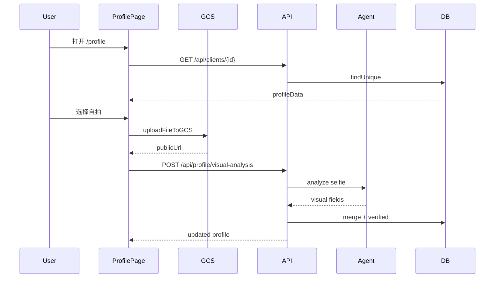

# 用户档案中心 (Profile Center) 功能设计方案

## 1. 核心思想

将用户时尚档案从「后台静默积累」变为「前台透明可见」。用户在对话中与 AI 互动时，系统通过 User Profile Agent 自动维护结构化档案；档案中心提供专属页面让用户查看档案全貌，并通过上传自拍触发外形分析，为 Stylist Agent 提供更可靠的配色与模特描述依据。

**V1 范围**：
- 只读展示 AI 维护的档案数据
- 自拍上传 → Visual Profile Agent 分析 → 写入已验证外形数据
- 手动编辑、偏好管理延后至 V2

---

## 2. 背景与现状

### 2.1 已有能力

| 能力 | 状态 | 相关文件 |
|------|------|----------|
| 档案存储 | 已有 | `server/db/schema.prisma` → `ClientProfile.profileData` |
| 对话自动更新 | 已有 | `app/api/generate-with-image/handlers/userProfileAgent.ts` |
| 外形验证门禁 | 已有 | `server/utils/userProfileVisual.ts` → `visual_profile_verified` |
| 档案读取 API | 已有 | `GET /api/clients/[clientId]` |
| 档案合并 API | 已有 | `PATCH /api/clients/[clientId]`（V1 前端不调用） |
| 图片上传 | 已有 | `lib/utils.ts` → `uploadFileToGCS()` + `/api/upload-url` |
| 档案中心 UI | **缺失** | 仅有 `/` 聊天和 `/wardrobe` 衣橱 |
| 自拍外形分析 | **缺失** | 代码注释已预留，无 API / Agent |

### 2.2 档案数据模型

基于 `UserProfileResult` 接口（`userProfileAgent.ts`），`profileData` JSON 包含：

```typescript
interface ProfileData {
  // 基础信息
  name: string;
  height: string;
  weight: string;
  location?: string;           // Gatekeeper 读天气用，对话 Agent 可写入

  // 风格档案
  personal_style: string;
  preferences: string[];

  // 外形分析（须 visual_profile_verified === true 才生效）
  skin_tone: string;
  body_shape: string;
  visual_features: {
    hair_color: string;
    detected_features: string;
  };

  // 元数据（档案中心写入）
  visual_profile_verified?: boolean;
  selfie_image_url?: string;
  selfie_analyzed_at?: string;  // ISO 8601
}
```

### 2.3 核心约束

对话流程中的 User Profile Agent **禁止**从衣物图或文字推断外形（见 `userProfileVisual.ts` 注释）。外形数据的唯一合法写入路径是：**用户在档案中心主动上传自拍**。

---

## 3. 系统架构



### 3.1 Agent 职责分离

| 维度 | 对话 Profile Agent | Visual Profile Agent |
|------|-------------------|---------------------|
| 输入 | 仅文字 | 自拍图片 URL |
| 可写字段 | 除外形外全部；外形原样复制旧档 | **仅** `skin_tone`, `body_shape`, `visual_features` |
| 系统指令 | 禁止从对话推断外形 | 专业、尊重的外形分析指令 |
| 触发场景 | 每轮对话 orchestrator | 仅档案中心上传 |
| 模型 | `AGENT_MODELS.userProfile` | `AGENT_MODELS.userProfile`（多模态） |

---

## 4. 用户故事（V1）

1. **查看档案**：从聊天页或衣橱页进入档案中心，看到身高体重、风格偏好、个人风格定位等 AI 积累的信息。
2. **了解外形状态**：未上传自拍时显示引导文案；已分析时展示肤色/身材/发型结论及自拍缩略图。
3. **上传自拍分析**：选择正面全身或半身自拍 → 上传 GCS → 触发 AI 分析 → 页面刷新展示外形结果。
4. **搭配受益**：后续 Stylist Agent 通过 `profileHasVisualData()` 读取已验证外形，生成更贴合的配色与模特描述。

---

## 5. 页面设计 (`/profile`)

路由：`/profile`。布局参照 `app/wardrobe/page.tsx`（左侧导航 + 主内容区），保持产品一致性。

### 5.1 页面区块

**A. 档案概览卡片**
- 展示 `name`（空则显示「未设置」）、`height` / `weight`
- 可选：`location`（若已有则展示）
- 档案完整度指示（P1）：统计已填字段数 / 总字段数，引导用户补全

**B. 风格档案**
- `personal_style`：描述性文字
- `preferences`：标签列表（chip 样式），只读展示
- 空状态：「继续和 AI 聊天，我会慢慢了解你的穿衣偏好」

**C. 外形分析（核心交互区）**
- **未验证状态**：说明文案 + 上传区域（单图，参考衣橱 `BatchUploader` 交互）
- **分析中**：loading +「正在分析您的外形特征…」
- **已验证状态**：展示 `skin_tone`、`body_shape`、`visual_features` 及自拍缩略图；提供「重新上传」按钮（覆盖旧分析）

**D. 数据来源说明（页脚小字）**
- 「基础信息与风格偏好由对话自动积累；外形分析需您主动上传自拍后生成」

### 5.2 导航入口

- `components/chat/ChatHeader.tsx`：「我的衣橱」旁增加「我的档案」
- `app/wardrobe/page.tsx` 侧边栏：增加档案入口
- 形成 `/` ↔ `/wardrobe` ↔ `/profile` 三角导航

### 5.3 前端文件结构

```
app/profile/page.tsx                          # 页面壳
components/profile/ProfileOverview.tsx        # 基础信息
components/profile/StyleSection.tsx           # 风格与偏好
components/profile/VisualAnalysisSection.tsx  # 自拍上传 + 结果展示
lib/api/profile.ts                            # fetchProfile / analyzeVisualProfile
```

### 5.4 UI 约定

- 复用 shadcn 组件（`Button`, `Card`, `Badge`, `Skeleton`）
- 偏好标签用 `Badge` variant="secondary"
- 上传区复用 `uploadFileToGCS` 模式，accept `image/*`，单文件
- 状态管理：组件内 `useState` + `useEffect`，无需新全局 store

---

## 6. 后端设计

### 6.1 新增 API：`POST /api/profile/visual-analysis`

**路径**：`app/api/profile/visual-analysis/route.ts`

**请求体**：
```json
{ "imageUrl": "https://storage.googleapis.com/..." }
```

**鉴权**：从 `X-Client-ID` 请求头读取 `clientId`（与 `lib/api-client.ts` 一致）

**处理流程**：
1. 校验 `imageUrl` 属于当前 `clientId` 的 GCS 路径（`user-uploads/{clientId}/`），防 SSRF
2. 从 DB 加载现有 `profileData`
3. 调用 Visual Profile Agent
4. 局部 merge 写入 DB（保留非外形字段）
5. 返回完整 `profileData`

**错误处理**：
- 非人物照 / 无法识别 → 422 +「请上传清晰的正面人像照片」
- 模型 429 → 复用 `server/utils/retryOn429.ts`

### 6.2 Visual Profile Agent

**建议路径**：`server/services/visualProfileAgent.ts`

**输出 Schema**：
```typescript
{
  skin_tone: string;      // 暖/冷调 + 穿搭色彩建议
  body_shape: string;     // 体型类型 + 穿搭建议
  visual_features: {
    hair_color: string;
    detected_features: string;  // 发型、配饰、气质等客观描述
  }
}
```

**安全约束**（写入 system instruction）：
- 客观专业，禁止贬低、年龄歧视、体型羞辱
- 不推断隐私信息（姓名、地址）
- 分析失败时返回明确错误，不编造

### 6.3 持久化策略

```typescript
const merged = {
  ...existingProfile,
  skin_tone: visualResult.skin_tone,
  body_shape: visualResult.body_shape,
  visual_features: visualResult.visual_features,
  visual_profile_verified: true,
  selfie_image_url: imageUrl,
  selfie_analyzed_at: new Date().toISOString(),
};
```

**连带修改**：对话 Profile Agent 的 `upsert` 目前全量覆盖 `profileData`。`applyVerifiedVisualFields()` 已保护外形字段，但元数据（`selfie_image_url` 等）可能被抹掉。需在持久化时保留元数据字段。

### 6.4 数据流



### 6.5 审计日志（P1）

扩展 `server/services/userProfileAuditLogger.ts` 或新增 `logs/visual-profile-audit.jsonl`，记录：clientId、imageUrl、分析结果、耗时、是否通过。

---

## 7. 与现有 Agent 管道的衔接

- **Stylist Agent**：已通过 `profileHasVisualData()` 判断外形可用性；验证后自动生效，无需改 prompt
- **对话 Profile Agent**：继续禁止从衣物图/文字推断外形；`applyVerifiedVisualFields` 保护已验证数据
- **Gatekeeper Agent**：`location` 字段在档案页只读展示；写入仍由对话 Agent 负责（V1 不做手动编辑）

---

## 8. 非目标（V1 明确不做）

- 手动编辑档案字段
- 删除/管理单条 preference
- 多自拍历史记录（V1 仅保留最新一张）
- 账号体系 / 多设备同步（仍基于 localStorage `clientId`）
- 从档案中心触发对话

---

## 9. V2 预留

- 手动编辑 + `manual_overrides` 字段，标记用户锁定项，AI 不再覆盖
- 偏好项增删、场合类噪声清洗（参考 `server/utils/userProfileEvaluator.ts`）
- 档案变更历史 / diff 视图
- 从 `logs/user-profile-audit.jsonl` 回溯 AI 写入记录

---

## 10. 验收标准

1. `/profile` 可正确展示当前 `profileData` 全部字段（含空状态）
2. 上传自拍后，外形区块展示 AI 分析结果，`visual_profile_verified === true`
3. 对话中发送衣物图**不会**写入外形字段
4. 已有外形数据时，对话 Profile Agent 更新偏好不会清空外形
5. 导航可从聊天页、衣橱页进入档案中心
6. 下一次搭配请求中，Stylist 能读到已验证外形并体现在 prompt 中

---

## 11. 实现优先级

### P0 — 必做

1. `POST /api/profile/visual-analysis` + Visual Profile Agent
2. `app/profile/page.tsx` + 三个展示组件
3. `lib/api/profile.ts`
4. 导航入口（ChatHeader + wardrobe sidebar）
5. 对话 Agent 持久化时保留 `selfie_*` 元数据

### P1 — 建议

6. GCS URL 归属校验
7. visual-profile 审计日志
8. 档案完整度指示器

### P2 — 可延后

9. 单元测试：visualProfileAgent 输出解析、merge 逻辑
10. E2E：上传 → 分析 → 展示链路

---

## 12. 相关文档

- [User Profile Agent 设计规格书](./agents/2_user_profile_agent_design.md)
- [多智能体架构设计](./multi_agent_architecture_design.md)
- [衣橱功能设计 v2](./wardrobe_feature_design_v2.md)
